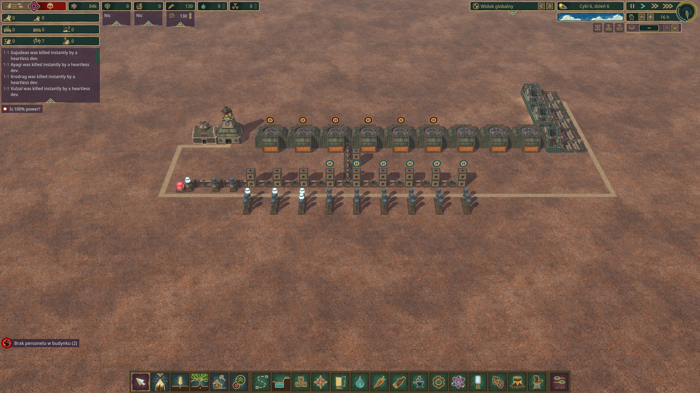

# Change the dev power building output to 400 or something cause it doesn't save changed values.
## You can delete the two relays and set memory cells RST to "2 CALL FOR LESS POWER"

Put in %userprofile%\Documents\Timberborn\Saves in some folder

